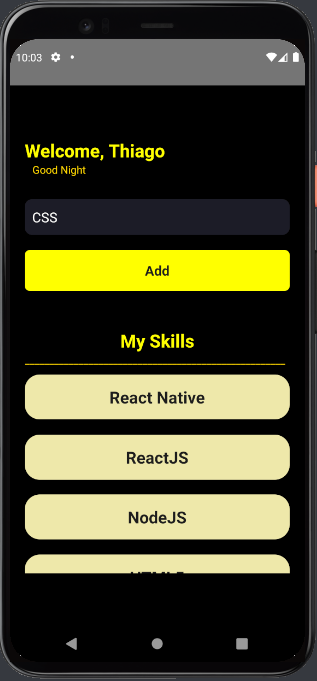

<h4 align="center"> 
	🚧 "My Skills" 🚀 App para fixação de aprendizado em React-Native 🚧
</h4>

<p align="center">
  

  

  <a href="https://github.com/ThiagoZellMendes/MySkills/commits/AppFacul">
    
  </a>

  
   <a href="https://github.com/ThiagoZellMendes/MySkills/stargazers">
    
  </a>
</p>


## 💻 Sobre o projeto

  - Mini-Aplicativo mobile, desenvolvido para praticar aprendizados adquiridos no curso "IGNITE" da RocketSeat em React-Native;
  - Nele o usuario pode adicionar e remover habilidades;
  - O projeto inicialmente feito em JavaScript puro, mas no decorrer da criação foi refatorado usando TypeScript;
  - Foram ultilizadas funções "Hooks" como useStates para controle e atualizações de estados da aplicação,
    assim como useEffect para rederizar componetes apos atualização do mesmo;
  - Todos os componentes foram criados separadamente para serem reaproveitados caso necessario.


## 🎨 Layout

<p align="center">
  
</p>


## 🛠 Tecnologias

As seguintes ferramentas foram usadas na construção do projeto:

- [Node.js][nodejs]
- [React Native][rn]
- [JavaScript][javascript]
- [TypeScript][typescript]

## 🚀 Como executar o projeto

O projeto foi criando em "CLI" e com o gerenciador de pacotes "NPX".


💡é Preciso um emulador para executar o app, no meu caso usei "AndroidStudio", mas pode ser usando outros meios:

### Pré-requisitos

Antes de começar, você vai precisar ter instalado em sua máquina as seguintes ferramentas:
[Git](https://git-scm.com), [Node.js][nodejs]. 
Além disto é bom ter um editor para trabalhar com o código como [VSCode][vscode]

### 🎲 Rodando o App:

```bash
# Clone este repositório
$ git clone https://github.com/ThiagoZellMendes/MySkills

# Acesse a pasta do projeto no terminal/cmd
$ cd MySkills

# Instale as dependências
$ npx install

# Execute a aplicação:
$ npx react-native run-android

``` 


## 😯 Como contribuir para o projeto

1. Faça um **fork** do projeto.
2. Crie uma nova branch com as suas alterações: `git checkout -b my-feature`
3. Salve as alterações e crie uma mensagem de commit contando o que você fez: `git commit -m "feature: My new feature"`
4. Envie as suas alterações: `git push origin my-feature`
> Caso tenha alguma dúvida confira este [guia de como contribuir no GitHub](https://github.com/firstcontributions/first-contributions)


## 📝 Licença

Este projeto esta sobe a licença MIT.

Feito com Muito Carinho por Thiago Mendes 👋🏽 [Entre em contato!](https://www.linkedin.com/in/thiago-mendes-44176249/)

[nodejs]: https://nodejs.org/
[rn]: https://facebook.github.io/react-native/
[yarn]: https://yarnpkg.com/
[TypeScript]: https://www.typescriptlang.org/pt/
[vscode]: https://code.visualstudio.com/
[JavaScript]:https://developer.mozilla.org/pt-BR/docs/Web/JavaScript
[license]: https://opensource.org/licenses/MIT
[vceslint]: https://marketplace.visualstudio.com/items?itemName=dbaeumer.vscode-eslint
[prettier]: https://marketplace.visualstudio.com/items?itemName=esbenp.prettier-vscode
